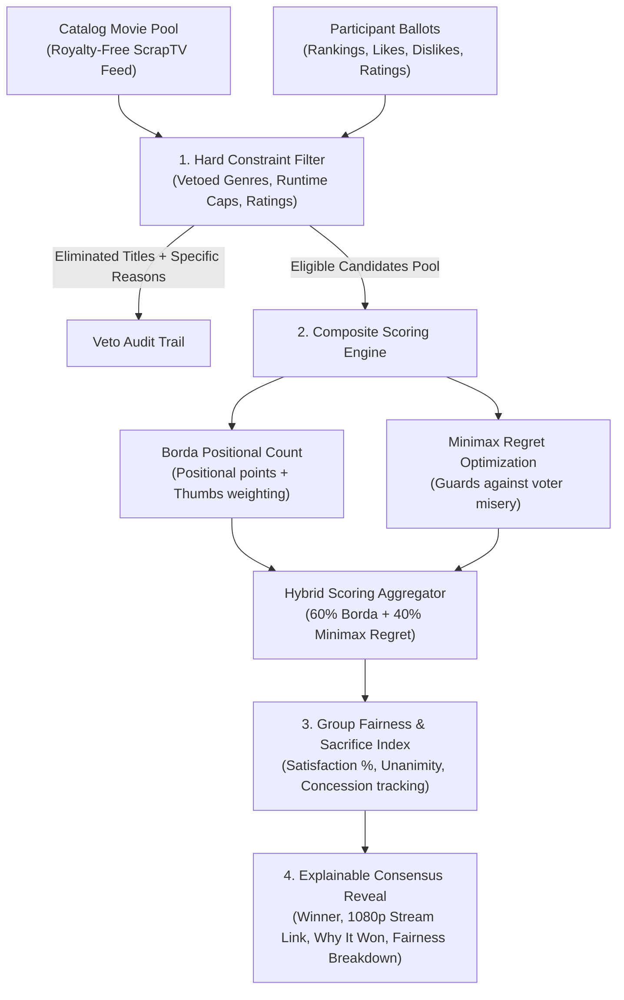

# Choicecraft 🎬✨

> **TV Group Consensus Platform for Fire TV (Vega OS) & Standalone Social Choice Engine**

[](LICENSE)
[](https://developer.amazon.com/docs/vega/latest/overview.html)
[](https://developer.amazon.com/docs/vega/latest/vega-rn-arch.html)
[](https://react.dev/)
[](https://www.typescriptlang.org/)
[](package.json)

---

## 💡 The Problem

Deciding what to watch on the living room TV in a group is notoriously exhausting:
* **The "Endless Scroll" Trap**: Groups spend 30–45 minutes scrolling through streaming catalogs, losing interest before a movie even starts.
* **Tyranny of the Majority**: Traditional simple voting ignores minority voter misery. If 3 people want Horror and 1 person cannot watch Horror, a simple majority vote picks a movie that ruins the night for that participant.
* **Ignored Personal Boundaries**: Critical dealbreakers (bedtime curfews, phobias, children's age-inappropriate content) are often overridden or awkward to negotiate out loud.

---

## 🚀 The Solution: Choicecraft

**Choicecraft** turns the TV into an intelligent, fair consensus hub:
1. **Host Launches on TV**: The TV displays a 10-foot cinema UI with a private room code and QR onboarding surface.
2. **Participants Join via Mobile Web**: Room members scan the QR code from their mobile browser—**no app download required**.
3. **Private Input Submission**: Each person privately submits hard dealbreakers (vetoed genres, maximum runtime, age ratings) and soft preferences (thumbs up/down, ballot rankings, star ratings).
4. **Deterministic Consensus Engine**: Choicecraft executes a 4-stage social choice algorithm to find the optimum group pick that maximizes group harmony while strictly honoring every individual dealbreaker.
5. **Transparent, Explainable Reveal**: The TV presents the winning title, streaming link, group fairness score, compromises audit, and transparent veto reasons.

---

## 🌟 Core Pillars & Capabilities

| Capability | Implementation in Choicecraft |
|---|---|
| **Fire TV Experience** | Native Vega OS 1.2 app built with React Native Kepler 4.0, D-pad remote navigation, overscan-safe 10-foot layout, flat typography architecture, and `.vpkg` deployment. |
| **Open Source Consensus Engine** | [`packages/choicecraft-core`](packages/choicecraft-core/): A decoupled, zero-dependency, pure TypeScript consensus & decision engine with MIT license, 100% test coverage, and standalone docs. |
| **Cloud Sync & Architecture** | Serverless room coordinator architecture designed for AWS Lambda, DynamoDB real-time session storage, and WebSocket/AppSync client sync. |
| **Developer Experience & Logs** | Real-world Vega SDK observations and Kepler runtime workarounds documented in [`docs/DEVLOG.md`](docs/DEVLOG.md) and [`docs/FRICTION_LOG.md`](docs/FRICTION_LOG.md). |

---

## 🔬 Multi-Stage Consensus Architecture

Choicecraft's decision pipeline is powered by `choicecraft-core`, grounded in modern social choice theory:



### The 4 Decision Stages:
1. **Hard Constraints & Vetoes**: Non-negotiable boundaries are applied deterministically. If any participant vetoes "Horror" or sets a 90-minute runtime cap, violating movies are eliminated immediately with explicit audit logging.
2. **Positional Borda Count**: Candidates earn points based on their placement on each voter's ballot, boosted by thumbs-up (+2) and penalized by thumbs-down (-3).
3. **Minimax Regret (Least Misery)**: Calculates maximum voter dissatisfaction for each candidate. Polarizing options that create extreme unhappiness for any single voter are penalized in favor of consensus crowd-pleasers.
4. **Fairness & Compromise Tracking**: Quantifies group emotional health (0–100% satisfaction score), logs who conceded their personal #1 pick for the collective good, and detects unanimous consensus.

---

## 🎨 TV User Experience (10-Foot UI)

Choicecraft is custom-crafted for the living room TV:
* **Midnight Cinema Palette**: Sleek dark theme (`#0A0E17`) with focus elevations (`#38BDF8`) for low-light living room viewing.
* **10-Foot Remote Friendly**: Full D-pad keyboard and remote controller navigation with `TVFocusGuideView` focus boundaries.
* **Royalty-Free Media Catalog**: Pre-bundled with 25 royalty-free titles from Amazon's official sample (`scrap-tv-feed` / [`src/data/scrapTvCatalog.json`](src/data/scrapTvCatalog.json)), including 16:9 poster imagery, runtimes, and sample 1080p MP4 streams.
* **Kepler Runtime Optimized**: Engineered strictly using flat typography trees to navigate Kepler 4.0 runtime nested text constraints.

---

## 📁 Repository Structure

```
Choicecraft/
├── packages/
│   └── choicecraft-core/        # Standalone social choice consensus engine
│       ├── src/
│       │   ├── algorithms/      # Borda, Minimax Regret, Hard Constraints, Fairness Index
│       │   ├── types.ts         # Domain-agnostic decision types
│       │   ├── engine.ts        # ChoicecraftEngine orchestrator
│       │   └── index.ts         # Barrel export
│       ├── tests/               # 14 Jest unit tests (100% passing)
│       ├── README.md            # Standalone package documentation & examples
│       ├── package.json         # Name: "choicecraft-core", 0 dependencies
│       └── LICENSE              # MIT License
├── src/                         # Fire TV Application (Vega OS / React Native Kepler)
│   ├── components/              # ActionCard, QRCodePlaceholder, Tile
│   ├── data/
│   │   └── scrapTvCatalog.json  # Bundled royalty-free media feed
│   ├── types/                   # Room, participant, and session state types
│   └── App.tsx                  # Main TV app & screen coordinator
├── test/                        # TV App Jest & snapshot test suite (12 tests)
├── docs/
│   ├── DEVLOG.md                # Chronological milestone log (Milestones 1–4)
│   └── FRICTION_LOG.md          # Real-world Vega SDK & Kepler developer log
├── build/                       # Generated .vpkg packages (x86_64, armv7, aarch64)
├── manifest.toml                # Vega OS package manifest (com.amazondeveloper.choicecraft)
├── package.json                 # TV app package configuration
└── LICENSE                      # MIT License
```

---

## 🛠️ Getting Started

### Prerequisites
* **Node.js**: `>= 20.0.0`
* **Vega SDK**: Version `0.24.12112` installed with `vega` CLI available in `$PATH`
* **Linux (x86_64)** with QEMU / KVM hardware virtualization support

### 1. Installation
```bash
git clone https://github.com/Supan-Roy/Choicecraft.git
cd Choicecraft
npm install
```

### 2. Run Test Suites
```bash
# Run TV App unit tests (12 tests)
npm test

# Run Choicecraft Core unit tests (14 tests)
npx jest --config packages/choicecraft-core/jest.config.js

# Run full project typecheck & linter
npx tsc --noEmit
npm run lint
```

### 3. Build Vega Packages (`.vpkg`)
```bash
# Build Debug packages for x86_64, armv7, and aarch64
npm run build:debug

# Build Release packages
npm run build:release
```
Packaged binaries will be located under `build/private/kepler/@amazon-devices/choicecraft/undefined/vega/<arch>/<BuildType>/@amazon-devices/choicecraft_<arch>.vpkg`.

### 4. Run on Vega Virtual Device
```bash
# 1. Start the Vega TV Virtual Device (in independent session)
setsid vega virtual-device start

# 2. Check device status
vega device list

# 3. Deploy and launch Choicecraft
vega run-app build/private/kepler/@amazon-devices/choicecraft/undefined/vega/x86_64/Debug/@amazon-devices/choicecraft_x86_64.vpkg com.amazondeveloper.choicecraft.main -d VirtualDevice
```

---

## 🧪 Open Source Standalone Usage

`choicecraft-core` can be used in any Node.js, Web, or React Native application independently of the TV UI:

```typescript
import { ChoicecraftEngine, Candidate, Participant } from 'choicecraft-core';

const candidates: Candidate[] = [
  { id: '1', title: 'Cosmic Journey', genres: ['Sci-Fi'], runtimeMinutes: 110 },
  { id: '2', title: 'Laugh Lounge', genres: ['Comedy'], runtimeMinutes: 85 },
  { id: '3', title: 'Fright Night', genres: ['Horror'], runtimeMinutes: 95 },
];

const participants: Participant[] = [
  {
    id: 'p1',
    name: 'Alice',
    hardConstraints: { vetoedGenres: ['Horror'] },
    rankedCandidateIds: ['1', '2'],
  },
  {
    id: 'p2',
    name: 'Bob',
    hardConstraints: { maxRuntimeMinutes: 90 },
    rankedCandidateIds: ['2', '1'],
  },
];

const engine = new ChoicecraftEngine({ algorithm: 'hybrid' });
const result = engine.evaluate(candidates, participants);

console.log('Consensus Winner:', result.winner.title); // Laugh Lounge
console.log('Group Satisfaction:', `${result.fairness.groupSatisfactionScore}%`);
console.log('Eliminated:', result.eliminated.map(e => `${e.candidateTitle}: ${e.explanation}`));
```

---

## 🤝 Community & Contributing

Contributions, bug reports, and discussions are welcome!
* [Contributing Guidelines](CONTRIBUTING.md)
* [Code of Conduct](CODE_OF_CONDUCT.md)
* [Security Policy](SECURITY.md)
* [Developer Log](docs/DEVLOG.md)
* [Friction Log](docs/FRICTION_LOG.md)

---

## 📄 License

This project is open-source under the [MIT License](LICENSE).  
Copyright (c) 2026 Choicecraft Authors / [Supan Roy](https://github.com/Supan-Roy).
