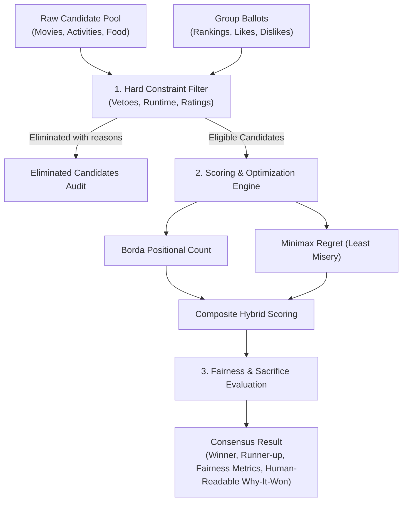

# Choicecraft Core (`choicecraft-core`)

> **Domain-agnostic group consensus and decision-making engine grounded in social choice theory.**
> Built for the **Amazon Developer Hackathon 2026 (Open Source Mini Challenge & Fire TV Track)**.

[](https://opensource.org/licenses/MIT)
[](https://www.typescriptlang.org/)
[](package.json)

---

## 🎯 What is Choicecraft Core?

Deciding what movie to watch, game to play, or restaurant to visit in a group is notoriously frustrating. Traditional voting systems suffer from classic pitfalls:
- **Plurality Voting ("First Past the Post")** causes tyranny of the majority and ignores deep voter dissatisfaction.
- **Pure Ranked Choice Voting** can overlook quiet consensus options in favor of polarizing extremes.
- **Unchecked Preferences** frequently pick options that violate strict personal dealbreakers (e.g. bedtime curfews, phobias, or age-inappropriate content ratings).

`choicecraft-core` is an open-source, zero-dependency, pure TypeScript engine that implements a **multi-stage consensus pipeline**:
1. **Hard Constraints & Veto Filtering**: Eliminates candidates that violate non-negotiable boundaries (e.g., maximum runtime, vetoed genres, content ratings).
2. **Positional Borda Count**: Awards points relative to ballot ranking, combined with preference weighting (likes, dislikes, star ratings).
3. **Minimax Regret Optimization**: Quantifies voter dissatisfaction for each candidate to minimize maximum group misery and prevent polarizing picks.
4. **Fairness & Sacrifice Tracking**: Generates transparent, human-readable explanations of compromises made, satisfaction variance, and unanimous consensus detection.

---

## 🏗️ Architecture Pipeline



---

## 📦 Installation

```bash
# Via npm (when published or consumed via local tarball/workspace)
npm install choicecraft-core
```

For monorepos or local projects (like the Choicecraft Fire TV app):
```json
{
  "dependencies": {
    "choicecraft-core": "file:./packages/choicecraft-core"
  }
}
```

---

## 🚀 Quick Start Example

```typescript
import { ChoicecraftEngine, Candidate, Participant } from 'choicecraft-core';

// 1. Define Candidates (Domain-agnostic: movies, board games, meals, etc.)
const candidates: Candidate[] = [
  {
    id: 'movie-1',
    title: 'Cosmic Odysseys',
    genres: ['Sci-Fi', 'Adventure'],
    runtimeMinutes: 115,
    contentRating: 'PG',
  },
  {
    id: 'movie-2',
    title: 'Midnight Shadows',
    genres: ['Horror', 'Thriller'],
    runtimeMinutes: 98,
    contentRating: 'R',
  },
  {
    id: 'movie-3',
    title: 'The Great Laugh',
    genres: ['Comedy'],
    runtimeMinutes: 90,
    contentRating: 'PG',
  },
];

// 2. Define Participants with individual constraints and preferences
const participants: Participant[] = [
  {
    id: 'user-alice',
    name: 'Alice',
    hardConstraints: {
      vetoedGenres: ['Horror'], // Hard dealbreaker
      maxRuntimeMinutes: 120,
    },
    rankedCandidateIds: ['movie-1', 'movie-3'],
    likedCandidateIds: ['movie-1'],
  },
  {
    id: 'user-bob',
    name: 'Bob',
    hardConstraints: {
      allowedContentRatings: ['G', 'PG'],
    },
    rankedCandidateIds: ['movie-3', 'movie-1'],
    ratings: {
      'movie-3': 5,
    },
  },
];

// 3. Initialize Engine and Evaluate
const engine = new ChoicecraftEngine({
  algorithm: 'hybrid', // Combines Borda preference with Minimax Regret
  bordaWeight: 0.6,
  minimaxWeight: 0.4,
});

const result = engine.evaluate(candidates, participants);

console.log('Winner:', result.winner.title);
console.log('Headline:', result.decisionSummary.headline);
console.log('Why It Won:', result.decisionSummary.whyItWon);
console.log('Group Satisfaction:', `${result.fairness.groupSatisfactionScore}%`);
console.log('Eliminated:', result.eliminated.map(e => `${e.candidateTitle}: ${e.explanation}`));
```

---

## 🔬 Core Algorithms Explained

### 1. Hard Constraints Filtering (`filterHardConstraints`)
Before any points are tallied, candidates are audited against each participant's non-negotiable boundaries:
- **`vetoedGenres`**: Discards candidates containing any blacklisted genre tags.
- **`maxRuntimeMinutes`**: Discards candidates exceeding the user's time limit (e.g. bedtime curfews).
- **`allowedContentRatings`**: Enforces family-friendly filters (e.g. strictly `G` and `PG`).
- **`vetoedCandidateIds`**: Individual title blacklists (e.g. "I've already seen this").
- **`customFilter`**: User-defined predicates for specialized business logic.

Eliminated items produce an `EliminationReason` detailing which participant's rule was triggered, ensuring full group transparency.

### 2. Positional Borda Scoring (`calculateBordaScores`)
Given $N$ eligible candidates:
- Rank 1 receives $N$ points.
- Rank 2 receives $N - 1$ points, down to Rank $N$ receiving 1 point.
- Thumbs-up likes grant $+2$ bonus points.
- Thumbs-down dislikes apply $-3$ penalty points.
- Star ratings apply a centered modifier: $(\text{rating} - 3) \times 1.5$.

### 3. Minimax Regret Optimization (`calculateMinimaxRegret`)
To prevent the "tyranny of a 51% majority", minimax regret calculates the maximum voter dissatisfaction:
$$\text{Regret}(c) = \max_{p \in P} \left( \text{Satisfaction}(p, \text{topPick}) - \text{Satisfaction}(p, c) \right)$$
Candidates that inflict extreme unhappiness on even one voter receive high regret penalties. The engine favors candidates that minimize this worst-case dissatisfaction.

### 4. Fairness Index & Compromise Tracking (`evaluateFairness`)
Quantifies the emotional health of the decision:
- **Group Satisfaction (0-100)**: Mean satisfaction across all participants.
- **Variance Score**: Detects imbalance (e.g. 3 users at 100%, 1 user at 10%).
- **Compromise Tracking**: Pinpoints who conceded their #1 choice for the collective good.
- **Unanimity Flag**: True if every participant shared the winning selection.

---

## ⚙️ Configuration Options

| Option | Type | Default | Description |
|---|---|---|---|
| `algorithm` | `'hybrid' \| 'borda' \| 'minimax_regret'` | `'hybrid'` | Selection strategy |
| `bordaWeight` | `number` | `0.6` | Weight assigned to Borda positional score (0.0 to 1.0) |
| `minimaxWeight` | `number` | `0.4` | Weight assigned to regret minimization (0.0 to 1.0) |
| `tieBreaker` | `'least_misery' \| 'borda' \| 'alphabetical'` | `'least_misery'` | Strategy to resolve score ties |

---

## 🧪 Testing

```bash
# Run standalone unit test suite
npm test
```

Includes unit tests covering hard constraints, Borda math, minimax regret calculations, fairness index metrics, and end-to-end engine orchestration.

---

## 🌟 Why Open Source Matters for Hackathons

`choicecraft-core` was designed from day one to be decoupled from any specific UI framework. While Choicecraft uses it for a **10-foot Fire TV (Vega OS)** experience, `choicecraft-core` can be embedded into:
- Web & Mobile apps (React, React Native, Vue, Flutter)
- Discord / Slack decision bots
- Streaming room backends & smart home hubs (Alexa Skills, AWS Lambda)

---

## 📄 License

MIT © [Choicecraft Authors / Supan Roy](LICENSE)
